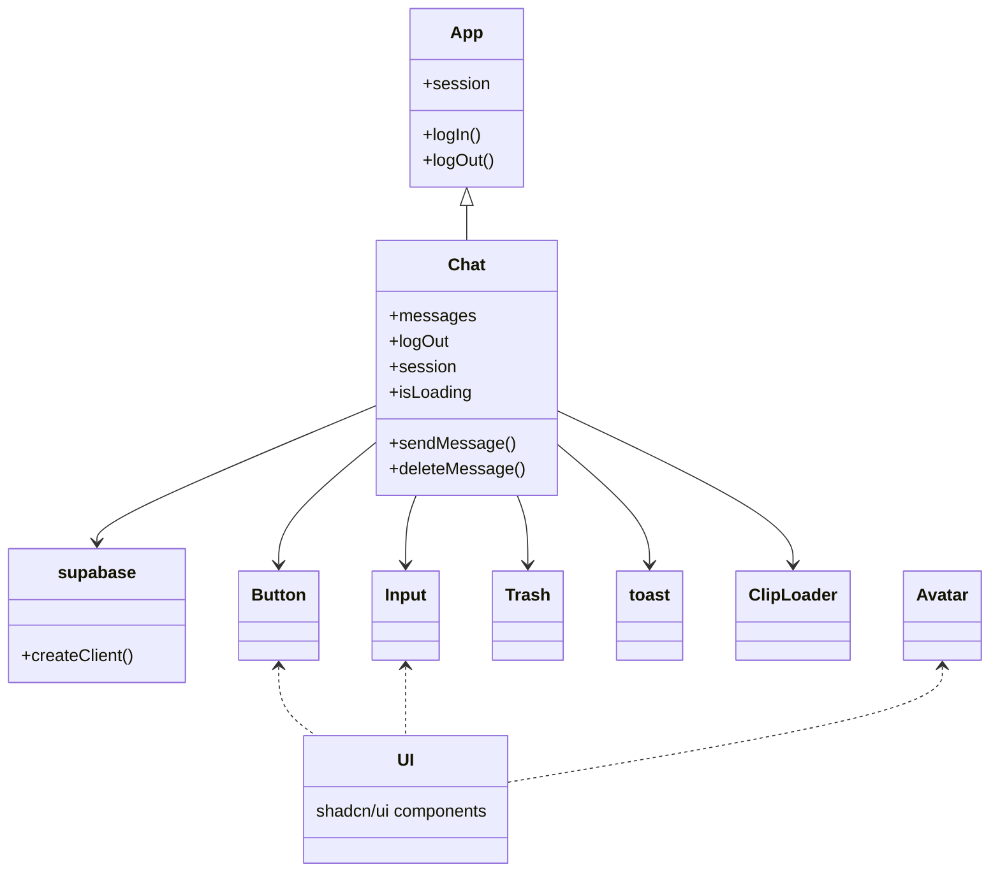

# React Supabase Chat App

A modern, real-time group chat application built with React, Vite, Supabase, and Tailwind CSS. Users can authenticate with Google and chat instantly in a shared room, leveraging Supabase's real-time features and scalable backend.

---

## 🛠️ Tech Stack

- **Frontend:** React 19, Vite, Tailwind CSS, shadcn/ui
- **Backend:** Supabase (Database, Auth, Realtime)
- **UI Components:** shadcn/ui, Lucide Icons, Radix UI
- **State & Utilities:** React Hooks, class-variance-authority, clsx, tailwind-merge

---

## ✨ Features

- 🔒 Google OAuth authentication (via Supabase)
- 💬 Real-time group chat (Supabase Realtime Channels)
- 🖼️ User avatars and display names
- 🗑️ Message deletion (own messages)
- 🎨 Modern, responsive UI with Tailwind CSS
- ⚡ Fast development with Vite

---

## 📦 Project Structure



---

## 🚀 Getting Started

### Prerequisites

- Node.js (v18+ recommended)
- Supabase project (free tier is sufficient)

### 1. Clone the repository

```bash
git clone https://github.com/your-username/react-supabase-chat-app.git
cd react-supabase-chat-app
```

### 2. Install dependencies

```bash
npm install
```

### 3. Configure environment variables

Create a `.env` file in the root directory and add your Supabase credentials:

```
VITE_SUPABASE_URL=your-supabase-url
VITE_SUPABASE_ANON_KEY=your-supabase-anon-key
```

You can find these in your [Supabase project settings](https://app.supabase.com/).

### 4. Start the development server

```bash
npm run dev
```

Open [http://localhost:5173](http://localhost:5173) to view the app.

---

## 🗂️ Key Files & Folders

- `src/App.jsx` – Handles authentication and main app logic
- `src/Chat.jsx` – Real-time chat UI and logic
- `src/supabase/supabase.js` – Supabase client setup
- `src/components/ui/` – Reusable UI components (Button, Input, Avatar)
- `src/lib/utils.js` – Utility functions
- `src/index.css` – Tailwind CSS and custom styles

---

## 🛠️ Customization

- Update the chat room name in `src/Chat.jsx` if you want multiple rooms.
- Style the UI further using Tailwind or shadcn/ui components.

---

## 📦 Deployment

To build for production:

```bash
npm run build
```

Then deploy the `dist` folder to your preferred static hosting (Vercel, Netlify, etc).

---

## 🤝 Contributing

Contributions are welcome! Please open issues or submit pull requests for improvements and bug fixes.

---

## 📄 License

MIT

---

## 🙏 Credits

- [Supabase](https://supabase.com/)
- [React](https://react.dev/)
- [Vite](https://vitejs.dev/)
- [Tailwind CSS](https://tailwindcss.com/)
- [shadcn/ui](https://ui.shadcn.com/)
- [Radix UI](https://www.radix-ui.com/)
- [Lucide Icons](https://lucide.dev/)
